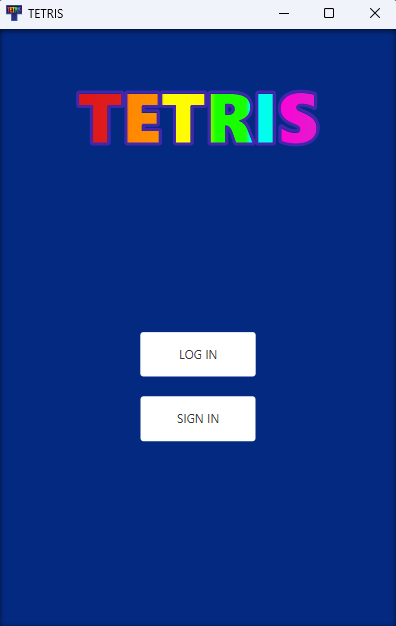
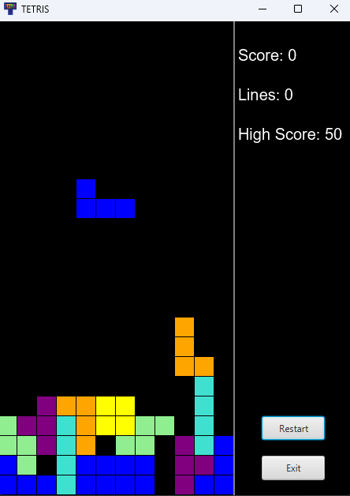

# Tetris Game

This project is a simplistic Java-based implementation of the classic Tetris game.

## Table of Contents

- [Description](#description)
- [Features](#features)
- [Installation](#installation)
- [Controls](#in-game-controls)
- [License](#license)

## Description

Tetris is a popular tile-matching puzzle game where the player manipulates falling blocks to create horizontal lines, which disappear upon completion. This implementation is built in Java and provides a simple and interactive Tetris gaming experience.

## Features

- Classic Tetris gameplay
- Responsive controls for movement and rotation
- Score tracking
- Game over detection
- Restart functionality
- Account-based highscore tracking

## Installation

For being able to run the fully functional application the user has to install the latest version of PostgreSQL along with the latest available JDBC driver.
After properly installing the pre-requisites the user has to modify the path to the database and to the driver to match the one on their computer.

## In-Game Controls

- Left Arrow: Move block left
- Right Arrow: Move block right
- Down Arrow: Move block down faster
- Up Arrow: Rotate block
- Restart Button: Restart the game

## License

This Tetris game is open-source and available under no license.
